<h1>
1. Pengenalan Diagram Alur
</h1>

> By : Mahendar Dwi Payana, S.ST., M.T

**Prasyarat :**
- Sebelum belajar *flowcart* atau *diagram alir* kita harus mengetahui terlebih dahulu apa itu *algoritma*. *Algoritma* merupakan langkah-langkah yang logis dan sistematis untuk menyelesaikan suatu masalah. *Algoritma* merupakan dasar dari pemrograman komputer. *Algoritma* dapat diimplementasikan dalam bentuk *flowchart* atau *pseudocode*.

--- 

## 1.1 Pengenalan dan Definisi Diagram alir (*Flowchart*)

[x] *Diagram Alir* atau *Flowchart* merupakan suatu diagram yang menggambarkan alur kerja suatu program.
[x] *Flowchart* adalah suatu diagram yang menggambarkan urutan langkah-langkah suatu proses dari awal program dijalankan sampai program tersebut berakhir mirip dengan algoritma tetapi menggunakan simbol-simbol tertentu.
[x] *Flowchart* digunakan dalam proses bisnis pada industri teknologi sistem informasi. *Flowchart* dapat digunakan untuk memodelkan proses bisnis yang ada, dan juga dapat digunakan untuk mendokumentasikan proses bisnis yang ada.

## 1.2 Kaidah-kaidah pembuatan *Flowchart*
Terdapat beberapa kaidah dalam pembuatan *flowchart* yaitu sebagai berikut:
- *Flowchart* dibuat dari atas ke bawah dan dari kiri ke kanan.
- *Flowchart* dibuat dengan menggunakan simbol-simbol tertentu.
- Aktifitas digambarkan harus didefinisikan dengan jelas dan hati-hati dan definisi harus dimengerti oleh pembacanya.
- Setiap langkah dari aktifitas harus diuraikan dengan menggunakan deskripsi **kata kerja**.
- Setiap langkah dari aktifitas harus berada pada uturan yang benar.
- Menggunakan simbol flowchart yang standar.
- Terdapat beberapa jenis *Diagram Alir* atau flowchart yaitu sebagai berikut:
  - **Flowchart Sistem** atau *System Flowchart*. Merupakan jenis *flowchart* yang menggambarkan alur kerja suatu sistem secara keseluruhan.. Menjelaskan urutan prosedur - prosedur pada suatu sistem
  - **Flowchart paperwork** atau *Document Flowchart*. Bagian dari *flowchart* sistem namun lebih terfokus pada alur kerja dokumen, laporan, surat-surat, serta termasuk tebusannya.
  - **Flowchart Skematik** atau *Schematic Flowchart*. Diagram alir program lebih teknis dengan tambahan-tambahan gambar teknis yang lebih detail.
  - **Flowchart Program** atau *Program Flowchart*. Diagram alir program lebih detail mengambarkan logika dari algoritma pemrograman.
  - **Flowchart Proses** atau *Process Flowchart*. Flowchart ini merupakan penggambaran rekayasa industri yang memecah dan menganalisis langkah-langkah selanjutnya dalam suatu prosedur atau sistem.

## 1.3 Simbol Flowchart

*Flowchart*/Diagram Alir dibuat dengan menggunakan simbol-simbol tertentu. Namun dari simbol tersebut dapat dibagi menjadi 4 bagian yaitu:
- Simbol Arus (*Flowchart*)
- Simbol Pemrosesan (*Processing*)
- Simbol Keputusan (*Decision*)
- Simbol Input/Output
Namun terdapat simbol-simbol tambahan yang digunakan dalam pembuatan *flowchart*. Untuk lebih jelasnya dapat dilihat pada gambar berikut ini.

Gambar 1.1 Simbol-simbol Flowchart

## 1.4 Implementasinya

Untuk lebih mudah memahami tentang *flowchart* mari kita perhatikan contoh-contoh *flowchart* berikut ini. *Flowchart* dibawah ini merupakan contoh alur program pengecekan bilangan bulat.

- Algoritma :
  1. Mulai
  2. Masukkan bilangan bulat
  3. Periksa apakah bilangan tersebut lebih besar dari 0
  4. Jika benar, maka tampilkan bilangan tersebut
  5. Jika salah, maka tampilkan pesan kesalahan
  6. Selesai

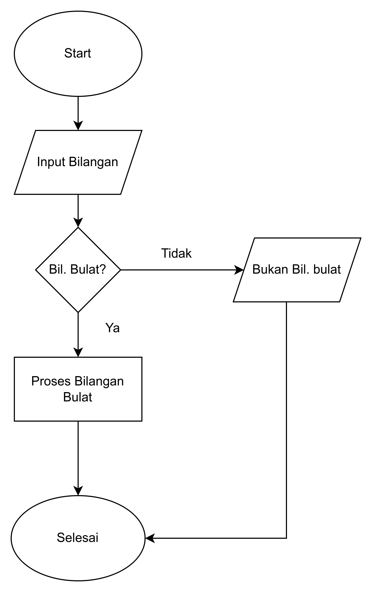

Gambar 1.2 Contoh Penggunaan Flowchart

Terdapat beberapa karakteritik dari *flowchart* yaitu:
- *Flowchart Sekuensial* 
- *Flowchart Percabangan* 
- *Flowchart Perulangan*

### 1.4.1 *Flowchart* Sekuensial

***Flowchart Sekuensial*** merupakan *flowchart* yang menggambarkan alur kerja suatu program yang berjalan secara berurutan. Contoh *flowchart* sekuensial dapat dilihat pada gambar berikut ini.

- Contoh: *flowchart* dari program menghitung persegi panjang. 

- **Algoritma**:
  1. Mulai
  2. Masukkan nilai panjang
  3. Masukkan nilai lebar
  4. Hitung luas persegi panjang
  5. Tampilkan luas persegi panjang
  6.  Selesai

- **Flowchart**

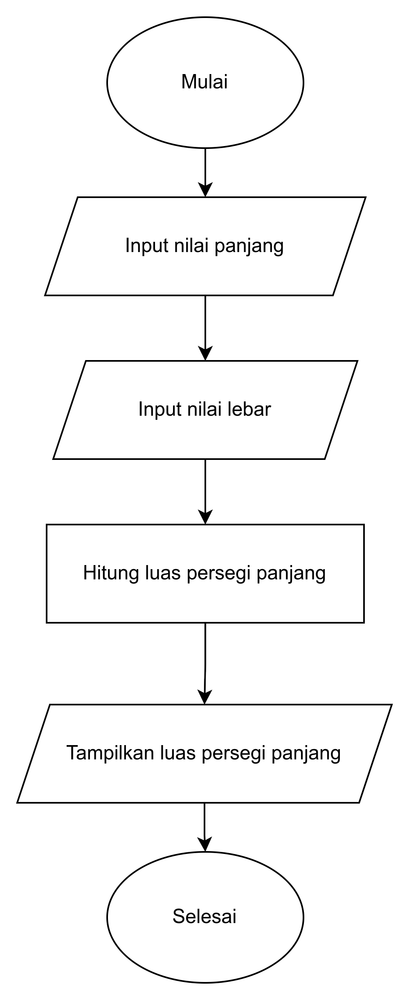

Gambar 1.3 Flowchart Pencarian Persegi Panjang

### 1.4.2 *Flowchart* Percabangan

*Flowchart* percabangan merupakan *flowchart* yang menggambarkan alur kerja suatu program yang memiliki percabangan atau kondisi pada program. Contoh *flowchart* percabangan dapat dilihat pada gambar berikut ini.

- Contoh:  `flowchart` program mencari angka ganjil dari 1 sampai 100.

- **Algoritma**:
  1. Menentukan nilai i = 1
  2. periksa i % 2 == 1
  3. jika benar, maka print i, jika salah maka lanjut ke langkah 4
  4. Tambahkan 1 pada nilai i
  5. Periksa nilai i baru > 100, jika salah ulangi langka ke 2, jika benar berhenti
- **Flowchart**

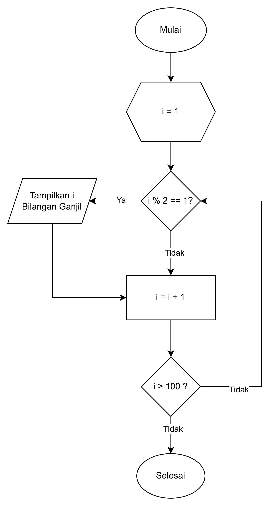

 Gambar 1.5 Flowchart 

### 1.4.3 *Flowchart* Perulangan
*Flowchart* perulangan merupakan *flowchart* yang menggambarkan alur kerja suatu program yang memiliki perulangan atau pengulangan pada program. Contoh *flowchart* perulangan terimplemtasi juga seperti pada Gambar 1.5.

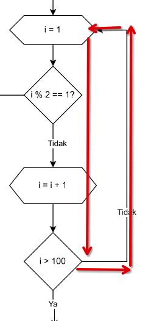

 Gambar 1.6 Flowchart 

## 1.5 Contoh Kasus Lain

- `Flowchart` mencari 3 angka terbesar A, B, dan C.
  

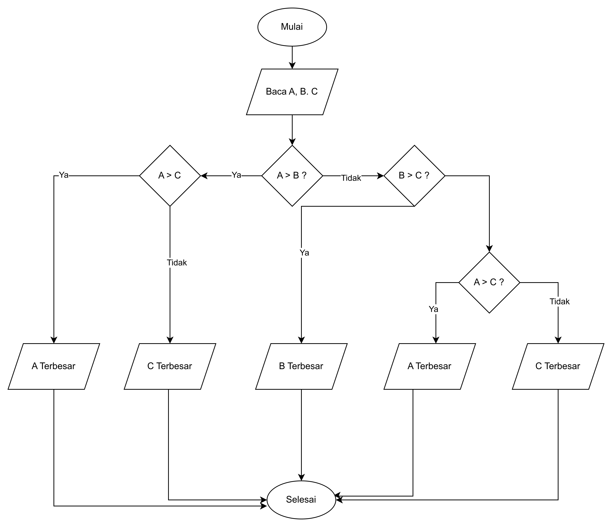

 Gambar 1.6 Flowchart Mencari 3 Angka Terbesar 

- `Flowchart` Mencari Nilai Factorial dari N

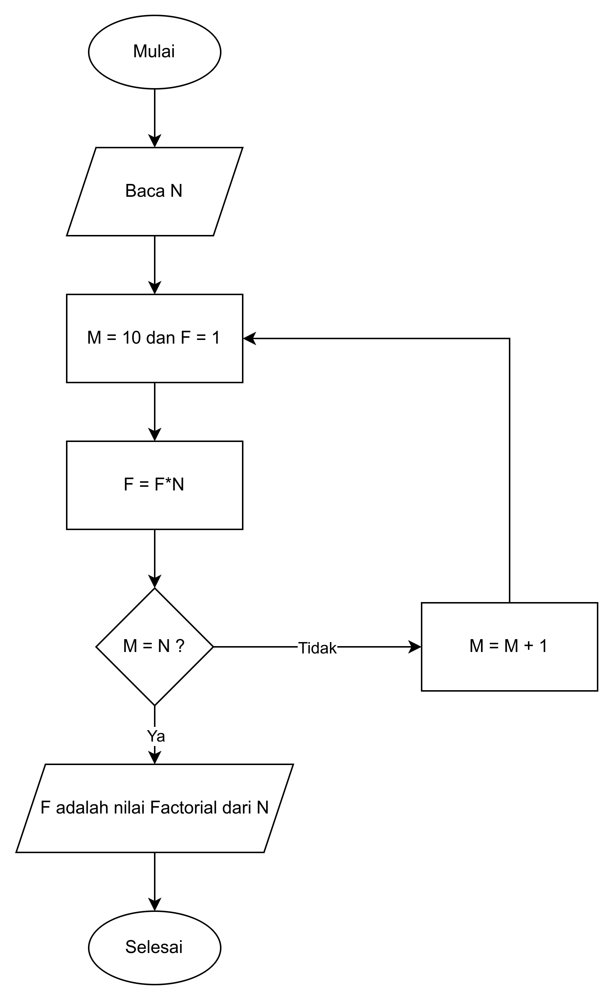

 Gambar 1.7 Flowchart Mencari Nilai Factorial dari N 
   

,

## 1.7 Tugas

1. Buatlah algoritma untuk menghitung konversi suhu dari celcius ke reamur, dan fahrenheit
   1. Input : Suhu dalam celcius
   2. Proses : R = 4/5 * C, F = 9/5 * C + 32
   3. Output : Suhu dalam reamur dan fahrenheit
2. Buatlah Algorima untuk mencari sisi miring dari suatu segitiga siku-siku, jika dikatehui panjang sisi yang membentuk sudut siku-sku.
   1. Input: a dan b, panjang sisi yang membentuk sudut siku-siku
   2. Proses: c = $\sqrt{a^2 + b^2}$
   3. output: (c), panjang sisi miring
3. Buatlah algoritma untuk menentukan suatu bilangan genap atau ganjil
   1. input : suatu bilangan
   2. output : bilangan genap atau ganjil atau nol
4. Buatlah algoritma untuk menghitung akar-akar persamaan kuadrat dengan rumus:
   1. D = B2 - 4 x A x C
   2. Jika D < 0 maka didapat akar imajiner
   3. Jika D = 0 maka X1 = X2 yang didapat dari D = -B / (2 x A)
   4. Jika D > 0 maka ada dua akar yang didapat dari rumus X1 = (-B + $\sqrt{D}$) / (2 x A) dan X2 = (-B - $\sqrt{D}$) / (2 x A)
5. Mencari 10 bilangan genap pertama dan jumlah totalnya
   1. Menguji apakah suatu suhu (dalam celcius) adalah beku, cair, atau uap
   2. Input : suhu dalam celcius (bilangan bulat)
   3. Proses : jika < 0 sama dengan beku, jika 0-100 sama dengan cair, jika > 100 sama dengan uap
   4. Output : beku, cair, atau uap
6. Mengetahui bilangan terbesar dari `n` buah bilangan yang diberikan user
   1. Input : n buah bilangan
   2. Proses : Simpan bilangan pertama sebagai bilangan terbesar, lalu bandingkan dengan bilangan kedua, jika bilangan kedua lebih besar maka bilangan kedua menjadi bilangan terbesar, lalu bandingkan dengan bilangan ketiga, jika bilangan ketiga lebih besar maka bilangan ketiga menjadi bilangan terbesar, dan seterusnya sampai bilangan ke-n
   3. Output : bilangan terbesar

1. Contoh Flowchart Cek 2 Bilangan Terbesar
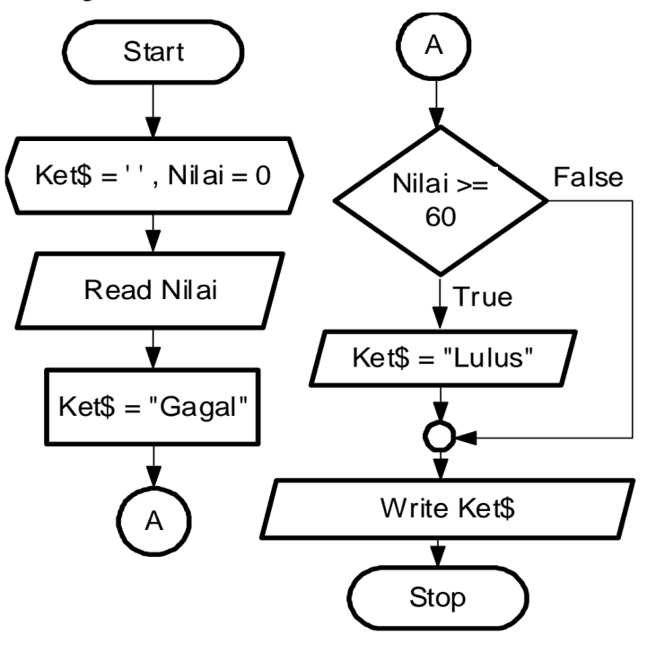

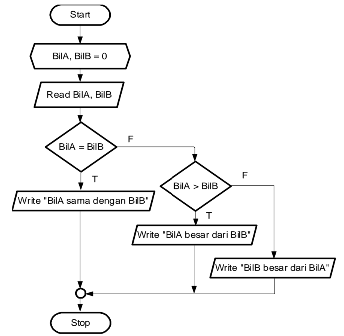
OR
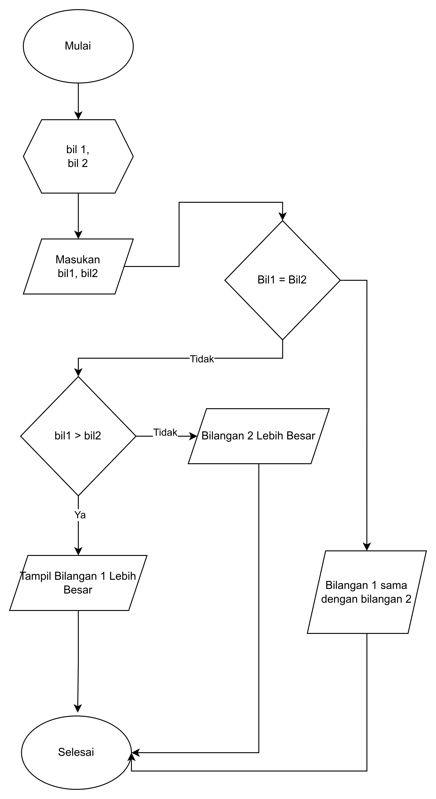

- Contoh Kasus penjualan Barang dengan kondisi pemilihan barang dan jumlah barang yang dibeli
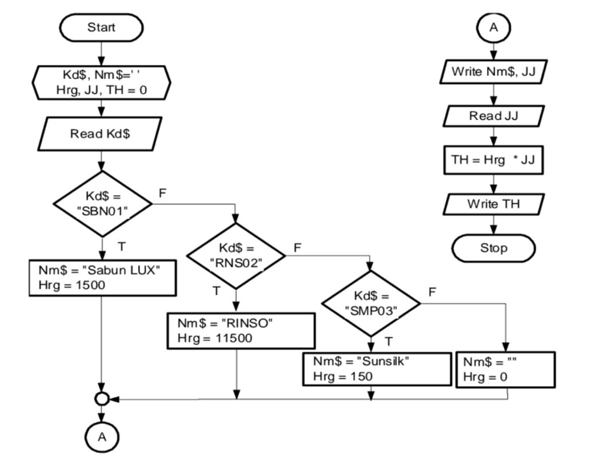

Cek bilangan Genap atau Ganjil
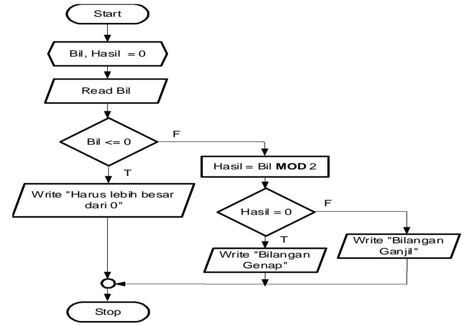

For
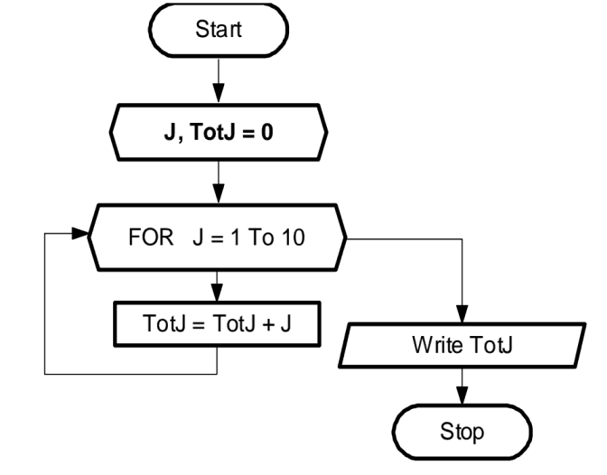

Rata-rata dari nilai yang diinputkan

Do Whhite Nilai rata-rata
- Nilai akhir diinput oleh user
- Kelipatann diinput oleh user

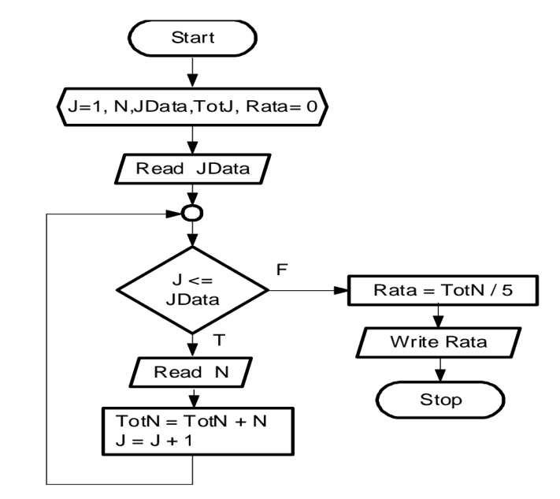

Contoh Lain While Next

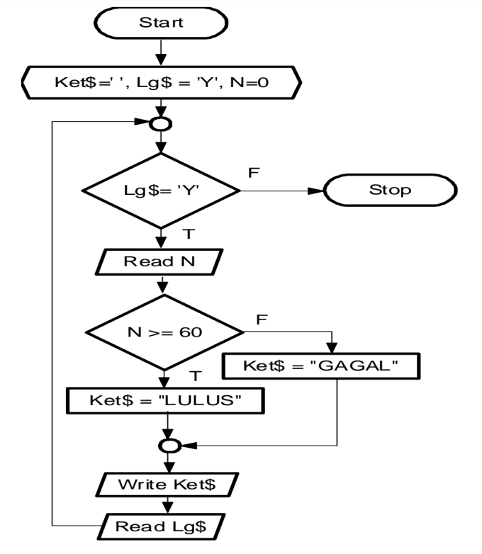

While Until
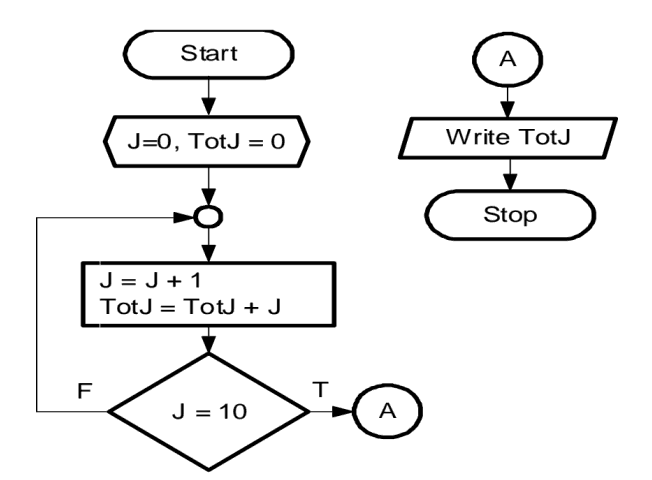

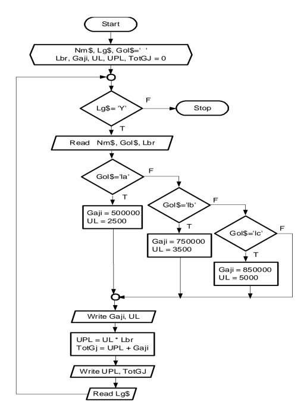

      <a href="0. Pendahuluan.md"><< Back</a>

    <a href="2. Pengenalan Java.md">Next >> </a>

