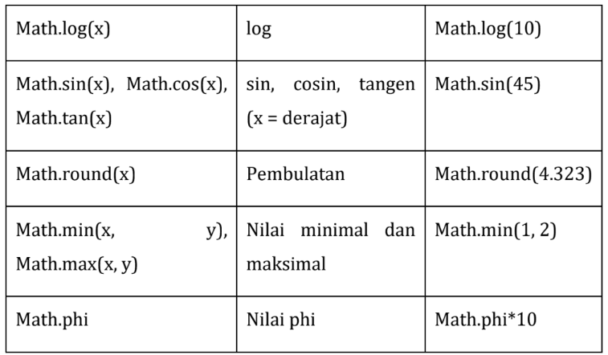
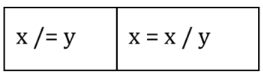
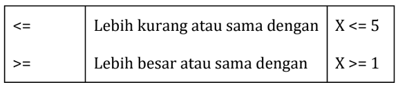
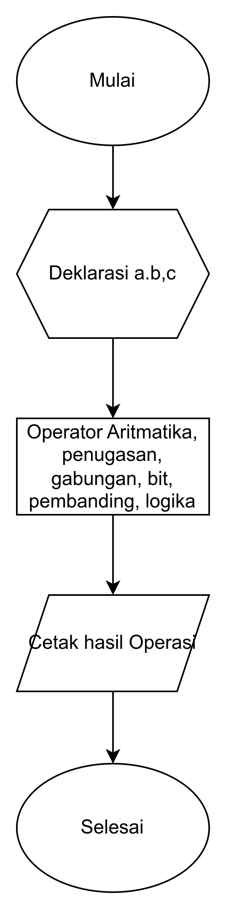
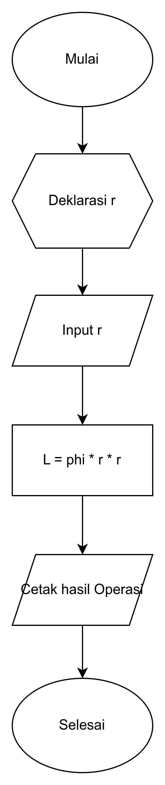

<h1><center>4. Operator & Ekspresi</center></h1>
<style>
   .mermaid {
      background-color: opaque;
      size: 50%;
      margin: auto;
      text-align: center;
   }
</style>

> By : Mahendar Dwi Payana, S.ST., M.T

**Prasyarat :**
1. [Pengenalan Algoritma & Flowchart](1.%20Pengenalan%20Flowchart.md)
2. [Pengenalan Java](2.%20Pengenalan%20Java.md)
3. [Variabel dan Implementasi](3.%20Variable.md)

**Referensi :**
1. Buku "Pemrograman Bororientasi Objek. Teori dan Implementasi Java"
2. Pengarang : Raden Budiarto
3. Tahun : 2018
4. Jenis : E-Book - [ebook play.books.com](https://play.google.com/books/reader?id=o_kdEAAAQBAJ&pg=GBS.PR8)

---

## 4.1 Pengenalan Operator & Ekspresi
**Ekspresi** adalah sebuah pernyataan yang menghasilkan nilai tunggal. Ekspresi dapat berupa konstanta, variabel, operator, dan pemanggilan fungsi. Nilai yang dihasilkan oleh pernyataan ini disebut dengan nilai balik (*return value*). Nilai balik ini dapat berupa nilai numerik, nilai karakter, nilai boolean, atau nilai objek.

**Operator** adalah simbol yang digunakan untuk melakukan operasi tertentu pada satu atau lebih operan. Operan adalah nilai atau variabel yang digunakan dalam ekspresi. Operator dapat digunakan untuk melakukan operasi aritmatika, relasional, logika, dan bit. Sebagai contoh : `a = 1+2` merupakan ekspresi yang terdiri dari dua operan yaitu `a` dan `1+2` dan operator `+`. Nilai balik dari contoh tersebut adalah nilai `3` yang merupakan hasil dari operasi penjumlahan `1+2`.

Java memiliki 7 Jenis Operator yaitu :
1. Operator **Aritmatika**
2. Operator **Penugasan**
3. Operator **Penggabungan**
4. Operator ***Increment*** dan ***Decrement***
5. Operator **Bit**
6. Operator **Pembanding**
7. Operator **Logika**
   
## 4.2 Operator Aritmatika
Operator aritmatika digunakan untuk melakukan operasi matematika seperti penjumlahan, pengurangan, perkalian, pembagian, dan modulus. Tabel berikut menampilkan operator aritmatika yang ada di Java.
<center>


<p>Gambar 4.1 Operator Aritmatika</p>
</center>

Contoh penggunaan operator aritmatika :

```java
int a = 1;
int b = 2;
int c = 3;

System.out.println(a + b); // 3
System.out.println(a - b); // -1
System.out.println(a * b); // 2

//memakai math
System.out.println(Math.pow(a, b)); // 1
// Memakai math.phi
System.out.println(Math.PI); // 3.141592653589793
```

## 4.3 Operator Penugasan
Operator penugasan digunakan untuk memberikan nilai pada variabel. Operator penugasan menggunakan tanda **sama dengan** `=`. Tabel berikut menampilkan operator penugasan yang ada di Java.

Operator penugasan dapat digunakan untuk melakukan operasi aritmatika dan operasi bit. 

Contoh penggunaan operator penugasan :

```java
int a = 1;
int b = 2;
int c = 3;

a += b; // a = 3
```

## 4.4 Operator Penggabungan
Operator penggabungan digunakan untuk menggabungkan dua buah string. Operator penggabungan menggunakan tanda **tambah sama dengan** `+=`. Tabel berikut menampilkan operator penggabungan yang ada di Java.

<center>

<br>

<p>Gambar 4.2 Operator Penugasan Gabungan</p>
</center>

Contoh penggunaan operator penugasan gabungan :

```java
String a = "Hello";
String b = "World";

a += b; // a = "HelloWorld"
```


## 4.5 Operator Increment dan Decrement
Operator increment dan decrement digunakan untuk menambah atau mengurangi nilai variabel sebesar 1. Operator increment menggunakan tanda **tambah satu** `++` dan operator decrement menggunakan tanda **kurang satu** `--`. Tabel berikut menampilkan operator increment dan decrement yang ada di Java.

Contoh penggunaan operator increment dan decrement :

```java
    for (int angka=1;angka<=10;angka++){
        System.out.println(angka);
    }

    for (int angka=10;angka>=1;angka--){
        System.out.println(angka);
    }
```

## 4.6 Operator Bit
Operator bit digunakan untuk melakukan operasi bit pada bilangan biner. Berikut contoh penggunaan operator bit.

```java
int a = 60; // --> 0011 1100
int b = 13; // --> 0000 1101
int c = 0; // --> 0000 0000

c = a & b; // 12 --> 0000 1100
c = a | b; // 61 --> 0011 1101
c = a ^ b; // 49 --> 0011 0001
c = ~a; // -61 --> 1100 0011
System.out.println(c);
```

## 4.7 Operator Pembanding
Operator pembanding digunakan untuk membandingkan dua buah nilai. Operator pembanding menghasilkan nilai boolean yaitu `true` atau `false`. Tabel berikut menampilkan operator pembanding yang ada di Java.

<center>


<p>Gambar 4.3 Operator Pembanding</p>
</center>

Contoh penggunaan Operator Pembanding pada java adalah sebagai berikut.
   
```java
int a = 1;
int b = 2;
int c = 3;

System.out.println(a == b); // false
System.out.println(a != b); // true
System.out.println(a > b); // false
System.out.println(a < b); // true
System.out.println(a >= b); // false
System.out.println(a <= b); // true
```

## 4.8 Operator Logika
Operator logika digunakan untuk melakukan operasi logika pada nilai boolean. Terdapat beberapa simbol yang digunakan untuk operator logika. Tabel berikut menampilkan operator logika yang ada di Java.

| Operator | Nama | Contoh |
| :---: | :---: | :---: |
| && | AND | a && b |
| \|\| | OR | a \|\| b |
| ! | NOT | !a |

Contoh penggunaan operator logika :

```java
boolean a = true;
boolean b = false;

System.out.println(a && b); // false
System.out.println(a || b); // true
System.out.println(!a); // false
```

## 4.9Latihan Operator dan Expresi

```java
public class Main {
    public static void main(String[] args) {
        int a = 1;
        int b = 2;
        int c = 3;
        double d = 10;
        double e = 3;

        String namaDepan = "Budi ";
        String namaBelakang = "handuk";

        //operasi penjumlahan
        int jumlah = a+b+c;

        //operasi pengurangan
        int selesih = c-a;

        //operasi perkalian
        int perkalian = c*b;

        //operasi pembagian
        double pembagian = d/e;

        //operasi modulus
        int modulus = b%a;

        //operasi increment
        // d++

        //operatso decrement
        // c--

        System.out.println("hasil penjumlahan a,b,c = adalah " + jumlah);
        System.out.println(selesih);
        System.out.println(pembagian);
        //untuk PI
        System.out.println(Math.PI);
        System.out.println(Math.sqrt(213));

        //operasi penugasan
        System.out.println(a+=b);
        System.out.println(namaDepan+=namaBelakang);

        //operator bit
        System.out.println(0 & 1);
        System.out.println(1 | 0);
        System.out.println(2^1);
        System.out.println(~0);

        //operator pembanding
        System.out.println(a == b);
        System.out.println(a > b);
        System.out.println(a < b);
        System.out.println(a >= b);

        //operator logika
        System.out.println(true || false);
        System.out.println(false && true);
    }
}
```

- Latihan di atas dapat dibuatkan flowchart sebagai berikut:
<center>

<p>Gambar 4.3 Operator Pembanding</p>
</center>

## suplement tambahan
- Input data pada java

```java
   int angka;

   //proses input di console  
   System.out.print("Masukan nilai anka : ");
   Scanner input = new Scanner(System.in);
   angka = input.nextInt();

   System.out.println("Angka yang diinput adalah : " + angka);
```

- Latihan soal : Luas lingkaran

```java
import java.util.Scanner;

public class Main {
    public static void main(String[] args) {
        // luas lingkaran = phi * r * r

        int jariJari;

        Scanner input = new Scanner(System.in);

        System.out.print("Masukan nilai Jari-jari : ");
        jariJari = input.nextInt();

        double luas = Math.PI * jariJari * jariJari;

        System.out.println("Luas lingkaran adalah " + luas);
    }
}
```

- Flowchart di atas adalah sebagai berikut
<center>

<p>Gambar 4.3 Operator Pembanding</p>
</center>