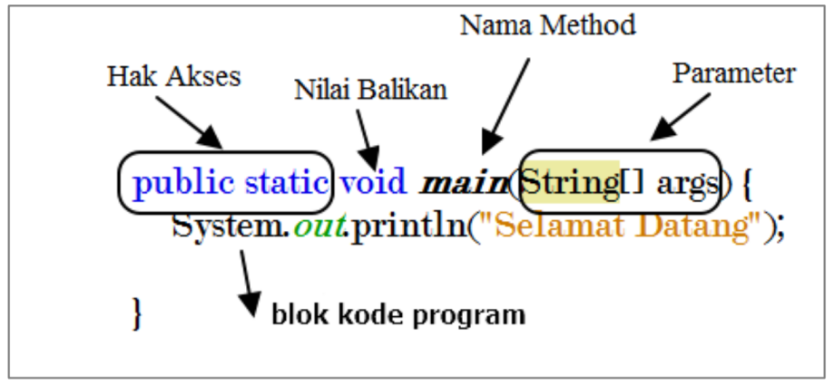
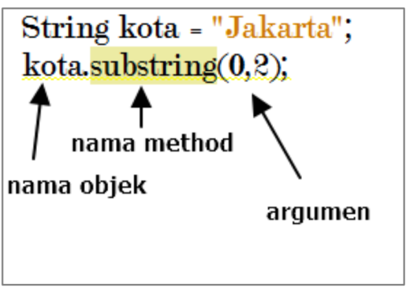

<h1><center>6. Method Java</center></h1>

> By : Mahendar Dwi Payana, S.ST., M.T

**Prasyarat :**
1. [Pengenalan Algoritma & Flowchart](1.%20Pengenalan%20Flowchart.md)
2. [Pengenalan Java](2.%20Pengenalan%20Java.md)
3. [Variabel dan Implementasi](3.%20Variable.md)
4. [Tipe Data dan Implementasi](4.%20Tipe%20Data.md)

**Referensi :**
1. Buku "Pemrograman Bororientasi Objek. Teori dan Implementasi Java"
2. Pengarang : Raden Budiarto
3. Tahun : 2018
4. Jenis : E-Book - [ebook play.books.com](https://play.google.com/books/reader?id=o_kdEAAAQBAJ&pg=GBS.PR8)

---

## 6.1 Pengenalan Method
***Method*** adalah sebuah blok kode yang berisi perintah-perintah yang dapat digunakan kembali. Method dapat digunakan untuk mengelompokkan perintah-perintah yang sering digunakan. ***Method*** juga dapat digunakan untuk mengelompokkan perintah-perintah yang berhubungan dengan suatu objek. <br>
Pada Dasarnya ***Method*** adalah bagian kode yang akan dipanggil oleh program utama. ***Method*** dapat dipanggil berulang-ulang sesuai dengan kebutuhan. ***Method*** juga dapat menerima input dan menghasilkan output. ***Method*** dapat dipanggil dari ***Method*** lainnya. Hampir semua bahasa pemrograman mengimplementasinya ***Method***. Salah satu keuntungan menggunakan ***method*** selain diatas adalah keuntungan dalam proses *maintanance* program. <br>

Selain itu method terdapat dua jenis yaitu ***build-in method*** dan ***user-defined method***. *Build-in method* adalah method yang sudah disediakan oleh bahasa pemrograman. Sedangkan *user-defined method* adalah method yang dibuat oleh user sesuai dengan kebutuhan. <br>

## 6.2 Implementasi Method
Untuk menggunakan ***Metode*** kita harus mengikut format penulisan yang sudah ditentukan oleh **JAVA**. Format penulisan ***Method*** pada **JAVA** adalah sebagai berikut.
```java
modifier returnType nameOfMethod (Parameter List) {
   // method body
}
```
Penjelasan dari format di atas adalah sebagai berikut.
1. **Modifier** : Sebuah ***Method*** dapat memiliki akses yang berbeda: `public`, `private`, `protected`, `default`. Dan seterusnya. 
2. **Return Type** : Sebuah ***Method*** dapat mengembalikan nilai. Nilai yang dikembalikan harus memiliki tipe data yang sesuai dengan tipe data yang telah ditentukan. Misalnya kita ingin mengembalikan nilai `int` maka kita harus menggunakan `int` pada ***Method***.
3. **Method Name** : Nama dari ***Method*** yang akan digunakan.
4. **Parameter List** : Daftar parameter yang akan digunakan pada ***Method***. Parameter adalah nilai yang akan digunakan pada ***Method***.
5. **Method Body** : Bagian dari ***Method*** yang berisi perintah-perintah yang akan dijalankan.

Berikut adalah ilustrasi dari format penulisan ***Method*** pada **JAVA**.


Setelah ***Method*** dibuat maka format pemanggilan adalah seperti pada Gambar dibawah ini.


## 6.3 Contoh Program Method
Mari kita coba membuat sebuah contoh penggunaan ***Method*** pada **JAVA**. Pada contoh ini kita akan membuat sebuah ***Method*** yang akan menghitung luas persegi panjang. Berikut adalah contoh programnya.
```java
public class Method {
    public static void main(String[] args) {
        int panjang = 10;
        int lebar = 5;
        int luas = hitungLuas(panjang, lebar); // Memanggil Method
        System.out.println("Luas Persegi Panjang = " + luas);
    }
    public static int hitungLuas(int panjang, int lebar) {
        int luas = panjang * lebar;
        return luas;
    }
}
```
Dari contoh diatas kita dapat melihat *method* `hitungLuas()` yang kemudian dipanggil kembali pada variabel `int luas = hitungLuas(panjang, lebar);`

## 6.4 Jenis Method
Pada **JAVA** terdapat 2 jenis ***Method*** berdasarkan nilai balik atau *return value* yaitu ***Method*** yang mengembalikan nilai dan ***Method*** yang tidak mengembalikan nilai. ***Method*** yang mengembalikan nilai disebut dengan ***Function***. Sedangkan ***Method*** yang tidak mengembalikan nilai disebut dengan ***Procedure***. Berikut adalah contoh ***Function*** dan ***Procedure*** pada **JAVA**.
```java
public class Method {
    public static void main(String[] args) {
        // Memanggil Method
        hitungLuas(10, 5); // Memanggil Procedure
        int luas = hitungLuas(10, 5); // Memanggil Function
        System.out.println("Luas Persegi Panjang = " + luas);
    }
    public static void hitungLuas(int panjang, int lebar) {
        int luas = panjang * lebar;
        System.out.println("Luas Persegi Panjang = " + luas);
    }
    public static int hitungLuas(int panjang, int lebar) {
        int luas = panjang * lebar;
        return luas;
    }
}
```
Pada contoh diatas kita dapat melihat ***Method*** `hitungLuas()` yang kemudian dipanggil kembali pada variabel `int luas = hitungLuas(panjang, lebar);` dan `hitungLuas(10, 5);` <br>
Pada `hitungLuas(10, 5);` kita dapat melihat bahwa ***Method*** tersebut tidak mengembalikan nilai. Sedangkan pada `int luas = hitungLuas(panjang, lebar);` kita dapat melihat bahwa ***Method*** tersebut mengembalikan nilai. <br>

<!-- Latihan Pagi -->
#### Latihan Pagi
1. Latihan 1
```java
public class Main {
    public static void main(String[] args) {
        int luas = PersegiPanjang(5,3);
        int luaslain = PersegiPanjang(100,60);
        System.out.println("Luas dari yang anda input adalah : "+ luas);
        System.out.println("Luas dari persegi panjang lain adalah : " + luaslain);
        System.out.println(namaMahasiswa("Budiawan"));
    }

    //method yang kita buat (user-defind method)
    public static int PersegiPanjang(int panjang, int lebar){
        int luas = panjang * lebar;
        return luas;
    }

    public static String namaMahasiswa(String nama){
        return nama;
    }
}
```
2. Latihan 2

```java
import java.util.Scanner;

public class Main {
    public static void main(String[] args) {
        int panjang = 10;
        int lebar;

        System.out.print("Masukan nilai panjang : ");

        Scanner input = new Scanner(System.in);
        panjang = input.nextInt();

        System.out.print("Masukan nilai lebar : ");
        lebar = input.nextInt();

        int luas = PersegiPanjang(panjang,lebar);
        System.out.println("Luas dari yang anda input adalah : "+ luas);
        System.out.println(namaMahasiswa("Budiawan"));
        System.out.println("Luas linkaran adalah : " + LuasLingkaran(13));
    }

    //method yang kita buat (user-defind method)
    public static int PersegiPanjang(int panjang, int lebar){
        int luas = panjang * lebar;
        return luas;
    }

    public static String namaMahasiswa(String nama){
        return nama;
    }

    public static double LuasLingkaran(int jariJari){
        double luas = 2 * Math.PI * jariJari;
        return luas;
    }
}

```

3. Latihan 3 (Perkalian 2 buah volume kubus)
```java
public class Main {
    public static void main(String[] args) {
        int hasil = PerkalianKubus(jumlahDuaVolumeKubus(3,2), jumlahDuaVolumeKubus(4,2));

        System.out.println("hasil dari perkalian dua kubus adalah " + hasil);
    }

    public static int jumlahDuaVolumeKubus(int kubusa, int kubusb){
        int volumeA = kubusa * kubusa * kubusa;
        int volumeB = kubusb * kubusb * kubusb;
        int total = volumeA + volumeB;
        return total;
    }

    public static int PerkalianKubus(int c, int d){
        return c * d;
    }

}
```
#### Latihan Siang

1. Latihan 1

```java
import java.util.Scanner;

public class Main {
    public static void main(String[] args) {
        int p;
        int l;
        
        System.out.println(persegiPanjang(3,2));
        System.out.println(persegiPanjang(34,12));
        hasilLuasLapanganBola();

        Scanner input = new Scanner(System.in);
        System.out.print("Masukan Panjang : ");
        p = input.nextInt();
        System.out.print("Masukan Lebar : ");
        l = input.nextInt();
        System.out.println("Luas persegi panjang adalah : "+persegiPanjang(p,l));

    }

    public static double persegiPanjang(int panjang, int lebar){
        int luas = panjang * lebar;
        return luas;
    }

    public static void hasilLuasLapanganBola(){
        System.out.println(persegiPanjang(100,60));
    }
}

```

2. Latihan 2

```java
import java.util.Scanner;

public class Main {
    public static void main(String[] args) {
        String nama;
        double tugas;
        double uts;
        double uas;
        double nilaiAkhir;

        Scanner input = new Scanner(System.in);

        System.out.println("=== Sistem penilaian mata kuliah === ");
        System.out.print("Nama Mahasiswa : ");
        nama = input.nextLine();

        System.out.print("Masukan nilai tugas ");
        tugas = input.nextDouble();

        System.out.print("Masukan nilai UTS ");
        uts = input.nextDouble();

        System.out.print("Masukan Nilai UAS ");
        uas = input.nextDouble();

        nilaiAkhir = hitungTugas(tugas) + hitungUts(uts) + hitungUas(uas);
        
        System.out.println(" --- Keterangan Hasil Perkuliahan --- ");
        System.out.println("Nama mahasiswa : "+nama);
        System.out.println("Nilai akhir adalah : " + nilaiAkhir );
        System.out.println("-- Terima kasih --");


    }

    public static double hitungTugas(double nilaiTugas){
        double tugas = 0.15 * nilaiTugas;
        return tugas;
    }

    public static double hitungUts(double nilaiUts){
        double uts = 0.35 * nilaiUts;
        return uts;
    }

    public static double hitungUas(double nilaiUas){
        double uas = 0.5 * nilaiUas;
        return uas;
    }
}
```

<div align="left">
      <a href="5. Suplemen-1.md"><< Back</a>
</div>
<div align="right">
    <a href="7. Strukutr Kendali.md">Next >> </a>
</div>